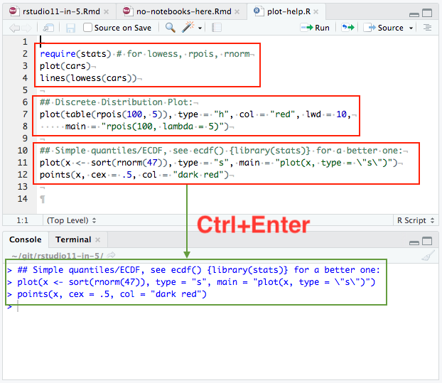

## The terminal

## Colored output in console

## Connections pane

## Connection wizard

## Object explorer

## Project templates

## Dark theme

## Knit anywhere

## Set notebook mode in header

## Create git branch

## Search addins

## Insert snippets in R console

## Ctrl+Enter in help pane

## Run paragraphs with Ctrl+Enter

## Copy To command

## F2 on data frames

## Ctrl+R for reverse search

## Ligature fonts

## RSP improvements

- Users can label sessions
- Users can force-quit sessions
- Admins can 
- Admins can enforce session cleanup

## The 1.1 Team

- Kevin Ushey (Dev)
- Gary Ritchie (Dev)
- Javier Luraschi (Dev)
- Karl Feinauer (Dev)
- Jonathan McPherson (Dev)
- Darby Hadley (QA)
- Ron Blum (QA)
